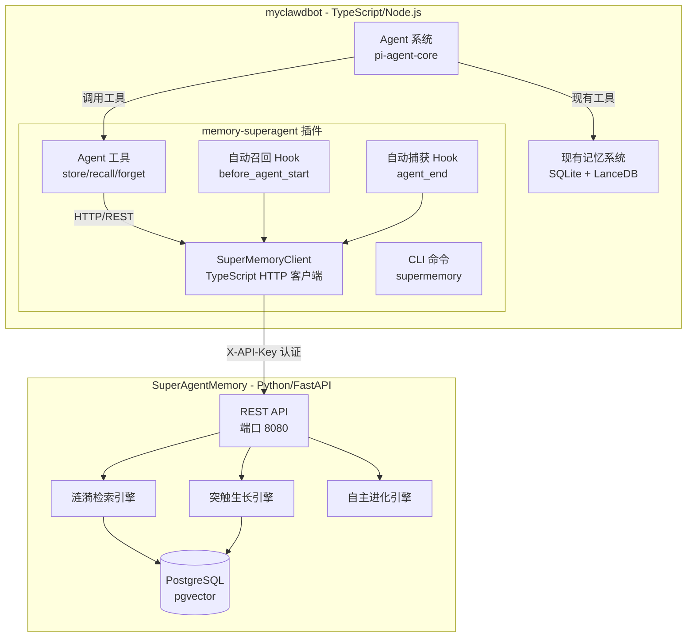

## 用户需求

将 `E:\SuperAgentMemory` 项目的记忆写入和召回能力接入 `E:\myclawdbot` 项目中。需要分析使用 SDK 还是 API 的接入方式，并提供记忆写入和召回能力。

## 产品概述

将 SuperAgentMemory 的涟漪检索、神经网络记忆关联、自动进化等高级记忆能力，以插件形式无缝集成到 myclawdbot 的 Agent 系统中，作为现有 SQLite/LanceDB 本地记忆的**互补增强层**，而非替代。SuperAgentMemory 提供 PostgreSQL + pgvector 的持久化存储和涟漪检索等高级能力，现有本地记忆系统继续负责文件索引和零依赖基础搜索。

## 核心功能

- **记忆写入**: 通过 Agent 工具 `supermemory_store` 将重要信息存储到 SuperAgentMemory，支持标签、重要性、agent_id/session_id、元数据、自动去重、自动突触关联
- **记忆召回**: 通过 Agent 工具 `supermemory_recall` 使用涟漪检索从 SuperAgentMemory 中召回相关记忆，支持跨 Agent、Session 分支过滤、衰减因子和连接强度控制
- **记忆管理**: 通过 Agent 工具 `supermemory_forget` 删除指定记忆（支持级联删除突触关联）
- **自动捕获**: 在 Agent 对话结束后，自动从对话内容中提取值得记忆的信息并存储
- **自动召回**: 在 Agent 开始处理前，根据用户消息自动检索相关记忆并注入上下文
- **CLI 管理**: 通过 `clawdbot supermemory` 命令行管理记忆（查询统计、搜索等）
- **健壮性**: 连接失败、超时、服务不可用时优雅降级，不影响主系统运行

## 技术栈选择

### 接入方式分析: API vs SDK

| 维度 | Python SDK | HTTP API |
| --- | --- | --- |
| 语言兼容性 | **Python only** -- myclawdbot 是 TypeScript，**无法直接使用** | **语言无关** -- TypeScript 原生 HTTP 调用 |
| 依赖 | 需要 pip install agent-memory-system | **零额外依赖** -- Node.js 内置 fetch |
| 维护成本 | 需维护 Python 运行时 | 仅 HTTP 客户端代码 |
| 功能完整性 | 封装了 store/retrieve/get/update/delete | **完整等价** -- 40+ 端点覆盖所有功能 |
| 实时性 | 同步/异步均支持 | 异步 fetch 原生支持 |


**结论: 选择 HTTP API 接入**。myclawdbot 是 TypeScript/Node.js 项目，Python SDK 无法直接使用。HTTP API 是语言无关的，功能完全等价，且 Node.js 22+ 内置 fetch API 无需额外依赖。

## 实现方案

### 策略: 创建 Extension 插件 (最小侵入)

遵循 myclawdbot 现有插件架构模式，创建 `extensions/memory-superagent/` 插件，参考 `extensions/memory-lancedb/` (591行) 的完整实现模式。这样完全不需要修改核心代码，仅通过插件注册机制接入。

### 架构设计



### 关键技术决策

1. **HTTP 客户端**: 使用 Node.js 22 内置 `fetch` API，不引入 httpx/axios 等外部依赖
2. **认证方式**: `X-API-Key` Header 认证，与 SuperAgentMemory 服务端 `APIKeyHeader(name="X-API-Key")` 完全对齐
3. **错误处理**: 连接失败时返回友好提示而非抛异常，确保不影响 Agent 主流程
4. **配置**: 遵循现有 `clawdbot.plugin.json` + `configSchema` 模式，支持 `uiHints`
5. **Agent ID 映射**: 使用 clawdbot 的 `sessionKey` 作为 SuperAgentMemory 的 `agent_id`，实现记忆隔离

## 实现注意事项

### 性能考量

- 记忆召回默认 `max_results=10, max_depth=3`，避免大结果集影响延迟
- 自动召回限制返回 top 3 条记忆，控制注入上下文长度
- 自动捕获限制每轮最多 3 条，与 memory-lancedb 行为一致
- 连接池复用: 单例 Client 实例，避免重复创建

### 健壮性

- 连接超时默认 10s，避免阻塞 Agent 主线程
- 服务不可用时优雅降级: `autoRecall` 失败返回空上下文，`autoCapture` 失败静默跳过
- 启动时可选健康检查，但不阻塞插件注册

### 向后兼容

- 不修改任何现有核心代码
- 插件独立可卸载，卸载后系统完全不受影响
- 工具命名使用 `supermemory_` 前缀，避免与现有 `memory_` 工具冲突

## 目录结构

```
E:\myclawdbot\extensions\memory-superagent\
├── clawdbot.plugin.json     # [NEW] 插件元数据 + configSchema (参考 memory-lancedb 格式)
├── index.ts                 # [NEW] 插件主入口 (注册工具 + Hooks + CLI + Service)
├── client.ts                # [NEW] TypeScript HTTP 客户端 (fetch 封装, 超时/重试/认证)
├── config.ts                # [NEW] 配置类型定义 + Schema 解析 + uiHints
├── tools.ts                 # [NEW] Agent 工具定义 (store/recall/forget 的参数和执行逻辑)
├── capture.ts               # [NEW] 自动捕获逻辑 (规则过滤 + 分类检测)
└── README.md                # [NEW] 插件文档
```

## 关键代码结构

### SuperMemoryClient (client.ts)

TypeScript HTTP 客户端，封装 SuperAgentMemory REST API 调用:

- `store(content, agentId?, sessionId?, importance?, tags?, metadata?)` -- POST `/v1/memory/store`
- `retrieve(query, agentId?, maxResults?, maxDepth?, decayFactor?, minStrength?)` -- POST `/v1/memory/retrieve`
- `get(atomId)` -- GET `/v1/memory/{id}`
- `update(atomId, content?, importance?, tags?, append?)` -- POST `/v1/memory/update?id={atomId}`
- `delete(atomId, cascade?)` -- DELETE `/v1/memory/{id}?cascade={cascade}`
- `healthCheck()` -- GET `/health`

构造参数: `baseUrl`, `apiKey`, `timeout` (默认 10s), `maxRetries` (默认 1)

### PluginConfig (config.ts)

配置类型:

- `server.baseUrl` (string, 默认 `http://localhost:8080`)
- `server.apiKey` (string, 支持环境变量解析 `${SUPERAGENT_MEMORY_API_KEY}`)
- `autoRecall` (boolean, 默认 true)
- `autoCapture` (boolean, 默认 true)
- `defaults.maxResults` (number, 默认 10)
- `defaults.maxDepth` (number, 默认 3)
- `defaults.importance` (number, 默认 0.7)

## Agent Extensions

### SubAgent

- **code-explorer**
- Purpose: 在实现阶段深入探索 myclawdbot 插件 SDK 的完整类型定义和注册 API 细节
- Expected outcome: 获取 ClawdbotPluginApi 类型定义、registerTool/on/registerCli/registerService 的完整签名，确保插件代码与核心 API 完全兼容