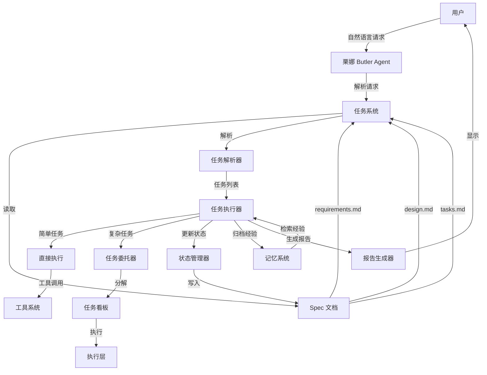
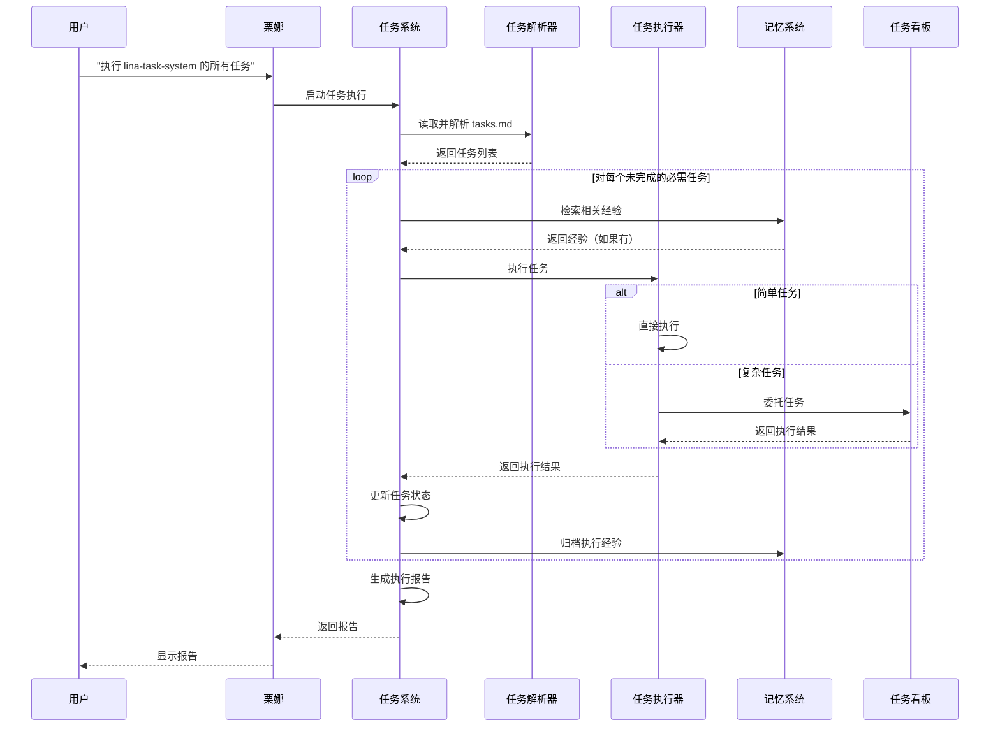

# 设计文档：栗娜主代理任务系统

## 概述

栗娜主代理任务系统（Lina Task System）为 Clawdbot 的管家层提供了类似 Kiro 的任务管理和执行能力。该系统使栗娜能够读取、理解和执行 .kiro/specs/ 目录下的规范文档，并与现有的多层 Agent 架构、任务分解系统和记忆系统无缝集成。

### 核心能力

1. **Spec 文档理解**：解析 requirements.md, design.md, tasks.md
2. **任务执行**：支持"运行所有任务"和"运行单个任务"模式
3. **智能分解**：简单任务直接执行，复杂任务委托给任务调度层
4. **状态跟踪**：实时更新任务状态并持久化到 tasks.md
5. **经验积累**：将任务执行经验存储到记忆系统

### 设计原则

- **最小侵入**：复用现有系统，不重复造轮子
- **渐进式增强**：从简单功能开始，逐步扩展
- **容错优先**：任务失败不应导致系统崩溃
- **用户友好**：提供清晰的进度反馈和错误信息

## 架构

### 系统架构图



### 数据流



## 组件和接口

### 1. TaskSystemCoordinator（任务系统协调器）

**职责**：协调整个任务系统的运行，处理用户请求。

**接口**：

```typescript
interface TaskSystemCoordinator {
  /**
   * 执行 Spec 的所有任务
   * @param specName - Spec 名称（如 "lina-task-system"）
   * @param options - 执行选项
   * @returns 执行报告
   */
  executeAllTasks(
    specName: string,
    options?: ExecuteOptions
  ): Promise<ExecutionReport>;

  /**
   * 执行 Spec 的单个任务
   * @param specName - Spec 名称
   * @param taskId - 任务编号（如 "2.1"）
   * @param options - 执行选项
   * @returns 执行报告
   */
  executeSingleTask(
    specName: string,
    taskId: string,
    options?: ExecuteOptions
  ): Promise<ExecutionReport>;

  /**
   * 查看 Spec 的任务进度
   * @param specName - Spec 名称
   * @returns 进度报告
   */
  getProgress(specName: string): Promise<ProgressReport>;

  /**
   * 继续执行中断的任务
   * @param specName - Spec 名称
   * @param options - 执行选项
   * @returns 执行报告
   */
  continueExecution(
    specName: string,
    options?: ExecuteOptions
  ): Promise<ExecutionReport>;
}

interface ExecuteOptions {
  /** 是否跳过可选任务 */
  skipOptional?: boolean;
  /** 是否在失败时停止 */
  stopOnFailure?: boolean;
  /** 是否自动重试失败任务 */
  autoRetry?: boolean;
  /** 最大重试次数 */
  maxRetries?: number;
}
```

### 2. SpecDocumentReader（Spec 文档读取器）

**职责**：读取和解析 Spec 文档。

**接口**：

```typescript
interface SpecDocumentReader {
  /**
   * 读取 Spec 文档
   * @param specName - Spec 名称
   * @returns Spec 文档内容
   */
  readSpec(specName: string): Promise<SpecDocuments>;

  /**
   * 验证 Spec 文档是否完整
   * @param specName - Spec 名称
   * @returns 验证结果
   */
  validateSpec(specName: string): Promise<ValidationResult>;
}

interface SpecDocuments {
  /** 需求文档内容 */
  requirements: string;
  /** 设计文档内容 */
  design: string;
  /** 任务列表内容 */
  tasks: string;
  /** Spec 目录路径 */
  specPath: string;
}

interface ValidationResult {
  /** 是否有效 */
  valid: boolean;
  /** 缺失的文件 */
  missingFiles: string[];
  /** 错误信息 */
  errors: string[];
}
```

### 3. TaskParser（任务解析器）

**职责**：解析 tasks.md 文件，提取任务列表和元数据。

**接口**：

```typescript
interface TaskParser {
  /**
   * 解析任务列表
   * @param tasksContent - tasks.md 文件内容
   * @returns 任务列表
   */
  parseTasks(tasksContent: string): Task[];

  /**
   * 提取任务元数据
   * @param task - 任务对象
   * @returns 任务元数据
   */
  extractMetadata(task: Task): TaskMetadata;
}

interface Task {
  /** 任务编号（如 "2.1"） */
  id: string;
  /** 任务描述 */
  description: string;
  /** 任务状态 */
  status: TaskStatus;
  /** 是否可选 */
  optional: boolean;
  /** 父任务编号（如果是子任务） */
  parentId?: string;
  /** 子任务列表 */
  children: Task[];
  /** 需求引用（如 ["1.2", "3.4"]） */
  requirementRefs: string[];
  /** 在 tasks.md 中的行号 */
  lineNumber: number;
}

type TaskStatus = "not_started" | "in_progress" | "completed";

interface TaskMetadata {
  /** 任务复杂度（1-10） */
  complexity: number;
  /** 是否需要分解 */
  needsDecomposition: boolean;
  /** 相关的设计章节 */
  designSections: string[];
  /** 相关的需求 */
  requirements: string[];
}
```

### 4. TaskExecutor（任务执行器）

**职责**：执行任务，处理简单任务和复杂任务的分发。

**接口**：

```typescript
interface TaskExecutor {
  /**
   * 执行任务
   * @param task - 任务对象
   * @param context - 执行上下文
   * @returns 执行结果
   */
  executeTask(task: Task, context: ExecutionContext): Promise<TaskResult>;

  /**
   * 评估任务复杂度
   * @param task - 任务对象
   * @param context - 执行上下文
   * @returns 复杂度评分（1-10）
   */
  assessComplexity(task: Task, context: ExecutionContext): Promise<number>;

  /**
   * 判断是否需要分解
   * @param task - 任务对象
   * @param complexity - 复杂度评分
   * @returns 是否需要分解
   */
  needsDecomposition(task: Task, complexity: number): boolean;
}

interface ExecutionContext {
  /** Spec 文档 */
  spec: SpecDocuments;
  /** 记忆服务 */
  memory: MemoryService;
  /** 任务委托器 */
  delegator: TaskDelegator;
  /** 工具系统 */
  tools: ToolSystem;
}

interface TaskResult {
  /** 任务编号 */
  taskId: string;
  /** 执行状态 */
  status: "success" | "failure" | "skipped";
  /** 执行消息 */
  message: string;
  /** 错误信息（如果失败） */
  error?: string;
  /** 执行时长（毫秒） */
  duration: number;
  /** 执行步骤 */
  steps: ExecutionStep[];
}

interface ExecutionStep {
  /** 步骤描述 */
  description: string;
  /** 步骤状态 */
  status: "success" | "failure";
  /** 步骤输出 */
  output?: string;
  /** 步骤错误 */
  error?: string;
}
```

### 5. TaskStateManager（任务状态管理器）

**职责**：管理任务状态，更新 tasks.md 文件。

**接口**：

```typescript
interface TaskStateManager {
  /**
   * 更新任务状态
   * @param specName - Spec 名称
   * @param taskId - 任务编号
   * @param status - 新状态
   * @returns 是否成功
   */
  updateTaskStatus(
    specName: string,
    taskId: string,
    status: TaskStatus
  ): Promise<boolean>;

  /**
   * 批量更新任务状态
   * @param specName - Spec 名称
   * @param updates - 状态更新列表
   * @returns 是否成功
   */
  batchUpdateStatus(
    specName: string,
    updates: TaskStatusUpdate[]
  ): Promise<boolean>;

  /**
   * 验证状态更新是否生效
   * @param specName - Spec 名称
   * @param taskId - 任务编号
   * @param expectedStatus - 期望状态
   * @returns 是否生效
   */
  verifyStatusUpdate(
    specName: string,
    taskId: string,
    expectedStatus: TaskStatus
  ): Promise<boolean>;
}

interface TaskStatusUpdate {
  /** 任务编号 */
  taskId: string;
  /** 新状态 */
  status: TaskStatus;
}
```

### 6. TaskReporter（任务报告生成器）

**职责**：生成任务执行报告和进度报告。

**接口**：

```typescript
interface TaskReporter {
  /**
   * 生成执行报告
   * @param results - 任务执行结果列表
   * @param options - 报告选项
   * @returns 执行报告
   */
  generateExecutionReport(
    results: TaskResult[],
    options?: ReportOptions
  ): ExecutionReport;

  /**
   * 生成进度报告
   * @param tasks - 任务列表
   * @returns 进度报告
   */
  generateProgressReport(tasks: Task[]): ProgressReport;
}

interface ExecutionReport {
  /** 总任务数 */
  totalTasks: number;
  /** 已完成任务数 */
  completedTasks: number;
  /** 失败任务数 */
  failedTasks: number;
  /** 跳过任务数 */
  skippedTasks: number;
  /** 总执行时长（毫秒） */
  totalDuration: number;
  /** 任务结果列表 */
  results: TaskResult[];
  /** 失败任务列表 */
  failures: TaskResult[];
  /** 下一步建议 */
  nextSteps: string[];
}

interface ProgressReport {
  /** 总任务数 */
  totalTasks: number;
  /** 已完成任务数 */
  completedTasks: number;
  /** 进行中任务数 */
  inProgressTasks: number;
  /** 未开始任务数 */
  notStartedTasks: number;
  /** 完成百分比 */
  completionPercentage: number;
  /** 任务列表（按状态分组） */
  tasksByStatus: {
    completed: Task[];
    inProgress: Task[];
    notStarted: Task[];
  };
}

interface ReportOptions {
  /** 是否包含详细步骤 */
  includeSteps?: boolean;
  /** 是否包含跳过的任务 */
  includeSkipped?: boolean;
}
```

## 数据模型

### 任务状态模型

```typescript
/**
 * 任务状态
 * - not_started: 未开始（checkbox: [ ]）
 * - in_progress: 进行中（checkbox: [-]）
 * - completed: 已完成（checkbox: [x]）
 */
type TaskStatus = "not_started" | "in_progress" | "completed";

/**
 * 任务状态到 Markdown checkbox 的映射
 */
const STATUS_TO_CHECKBOX: Record<TaskStatus, string> = {
  not_started: "[ ]",
  in_progress: "[-]",
  completed: "[x]",
};

/**
 * Markdown checkbox 到任务状态的映射
 */
const CHECKBOX_TO_STATUS: Record<string, TaskStatus> = {
  "[ ]": "not_started",
  "[-]": "in_progress",
  "[x]": "completed",
};
```

### 任务复杂度评估模型

```typescript
/**
 * 任务复杂度评估标准
 */
interface ComplexityFactors {
  /** 任务描述长度（字符数） */
  descriptionLength: number;
  /** 需求引用数量 */
  requirementCount: number;
  /** 是否有子任务 */
  hasSubtasks: boolean;
  /** 子任务数量 */
  subtaskCount: number;
  /** 是否涉及多个模块 */
  multiModule: boolean;
  /** 是否涉及外部系统 */
  externalSystem: boolean;
}

/**
 * 复杂度评分规则
 * - 1-3: 简单任务（直接执行）
 * - 4-6: 中等任务（可能需要分解）
 * - 7-10: 复杂任务（必须分解）
 */
function calculateComplexity(factors: ComplexityFactors): number {
  let score = 1;

  // 描述长度
  if (factors.descriptionLength > 100) score += 1;
  if (factors.descriptionLength > 200) score += 1;

  // 需求引用
  if (factors.requirementCount > 2) score += 1;
  if (factors.requirementCount > 5) score += 1;

  // 子任务
  if (factors.hasSubtasks) score += 2;
  if (factors.subtaskCount > 3) score += 1;

  // 多模块
  if (factors.multiModule) score += 2;

  // 外部系统
  if (factors.externalSystem) score += 1;

  return Math.min(score, 10);
}
```

### 记忆存储模型

```typescript
/**
 * 任务执行经验
 */
interface TaskExperience {
  /** 任务描述 */
  taskDescription: string;
  /** Spec 名称 */
  specName: string;
  /** 任务编号 */
  taskId: string;
  /** 执行时间 */
  executedAt: Date;
  /** 执行步骤 */
  steps: ExecutionStep[];
  /** 遇到的问题 */
  problems: string[];
  /** 解决方案 */
  solutions: string[];
  /** 执行时长（毫秒） */
  duration: number;
  /** 是否成功 */
  success: boolean;
}

/**
 * 记忆查询条件
 */
interface MemoryQuery {
  /** 任务描述关键词 */
  keywords: string[];
  /** Spec 名称（可选） */
  specName?: string;
  /** 最大结果数 */
  limit?: number;
}
```

## 正确性属性

*属性（Property）是一个特征或行为，应该在系统的所有有效执行中保持为真——本质上是关于系统应该做什么的正式陈述。属性是人类可读规范和机器可验证正确性保证之间的桥梁。*


### 属性 1：Spec 路径解析正确性

*对于任何* 有效的 Spec 名称，调用路径解析函数应该返回正确的 .kiro/specs/{spec-name}/ 目录路径。

**验证：需求 1.1**

### 属性 2：文档解析完整性

*对于任何* 有效的 Spec 文档（requirements.md, design.md, tasks.md），解析函数应该提取所有关键信息（需求列表、设计概述、任务列表）且不丢失任何内容。

**验证：需求 1.2, 1.3, 1.4**

### 属性 3：错误处理清晰性

*对于任何* 不存在的 Spec 目录或缺失的文档文件，系统应该返回清晰的错误信息，明确指出缺失的内容。

**验证：需求 1.5**

### 属性 4：Checkbox 解析正确性

*对于任何* 包含 Markdown checkbox 语法的任务列表，解析器应该正确识别所有 checkbox 状态（[ ], [-], [x]）并映射到对应的任务状态。

**验证：需求 2.1**

### 属性 5：任务信息完整提取

*对于任何* 任务条目，解析器应该提取所有关键信息（任务编号、描述、状态、可选标记、需求引用）且不遗漏任何字段。

**验证：需求 2.2, 2.3, 2.5**

### 属性 6：任务层级正确性

*对于任何* 多层级任务列表，解析器应该正确识别父子关系，且每个子任务都能找到其父任务。

**验证：需求 2.4**

### 属性 7：任务执行顺序性

*对于任何* 任务列表，"运行所有任务"模式应该按照任务编号顺序执行所有未完成的必需任务，且不改变执行顺序。

**验证：需求 3.1**

### 属性 8：单任务执行精确性

*对于任何* 指定的任务编号，"运行单个任务"模式应该只执行该任务，不执行其他任务。

**验证：需求 3.2**

### 属性 9：任务过滤正确性

*对于任何* 任务列表，执行时应该跳过所有已完成的任务和可选任务（除非明确要求执行可选任务）。

**验证：需求 3.3, 3.4**

### 属性 10：状态更新往返一致性

*对于任何* 任务，更新状态后再读取 tasks.md 文件，应该能够读取到更新后的状态，且文件格式和结构保持不变。

**验证：需求 4.1, 4.2, 4.3, 4.4, 4.5**

### 属性 11：复杂度评估一致性

*对于任何* 任务，复杂度评估应该基于明确的标准（描述长度、需求数量、子任务数量等），相同特征的任务应该得到相同的复杂度评分。

**验证：需求 5.1**

### 属性 12：执行路径选择正确性

*对于任何* 任务，当复杂度评分 ≤ 3 时应该直接执行，当复杂度评分 ≥ 7 时应该委托给 TaskDelegator。

**验证：需求 5.2, 5.3**

### 属性 13：任务委托参数完整性

*对于任何* 委托的任务，传递给 TaskDelegator 的参数应该包含任务描述、所有需求引用和相关设计文档。

**验证：需求 5.4**

### 属性 14：异步等待正确性

*对于任何* 委托的任务，系统应该等待任务完成并接收执行结果，不应该在任务完成前继续执行下一个任务。

**验证：需求 5.5**

### 属性 15：错误记录完整性

*对于任何* 失败的任务，系统应该记录失败原因和完整的错误信息，包括错误堆栈和上下文。

**验证：需求 6.1**

### 属性 16：执行报告统计准确性

*对于任何* 任务执行结果列表，生成的报告中的统计数据（已完成、失败、跳过数量）应该与实际执行结果完全一致。

**验证：需求 7.1, 7.2, 7.3, 7.4, 7.5**

### 属性 17：记忆归档往返一致性

*对于任何* 完成的任务，归档到记忆系统的经验应该包含完整的任务信息，且能够通过检索功能找回。

**验证：需求 8.1, 8.2, 8.3, 8.5**

### 属性 18：经验应用有效性

*对于任何* 检索到的相关经验，系统应该参考经验中的执行步骤和解决方案，且执行结果应该与经验中的结果相似。

**验证：需求 8.4**

### 属性 19：接口集成正确性

*对于任何* 任务执行过程，系统应该正确调用现有的接口（ButlerAgent, TaskDelegator, TaskBoard, MemoryService, ToolSystem），不应该绕过或重复实现这些接口。

**验证：需求 9.1, 9.2, 9.3, 9.4, 9.5**

### 属性 20：意图识别准确性

*对于任何* 用户输入的自然语言请求，系统应该正确识别用户意图（运行所有任务、运行单个任务、继续执行、查看进度），且识别结果应该与用户的真实意图一致。

**验证：需求 10.1, 10.2, 10.3, 10.4**

## 错误处理

### 错误类型

1. **文件系统错误**
   - Spec 目录不存在
   - 文档文件缺失
   - 文件读取失败
   - 文件写入失败

2. **解析错误**
   - 文档格式错误
   - 任务列表格式错误
   - 任务编号重复
   - 任务引用无效

3. **执行错误**
   - 任务执行失败
   - 工具调用失败
   - 委托任务失败
   - 超时错误

4. **集成错误**
   - TaskDelegator 不可用
   - MemoryService 不可用
   - TaskBoard 不可用
   - 工具系统不可用

### 错误处理策略

#### 1. 快速失败（Fail Fast）

对于致命错误（如 Spec 目录不存在），立即停止执行并返回清晰的错误信息：

```typescript
async function readSpec(specName: string): Promise<SpecDocuments> {
  const specPath = path.join(".kiro/specs", specName);
  
  // 快速失败：目录不存在
  if (!fs.existsSync(specPath)) {
    throw new Error(
      `Spec 目录不存在: ${specPath}\n` +
      `请确认 Spec 名称是否正确，或使用 'ls .kiro/specs' 查看可用的 Spec。`
    );
  }
  
  // 快速失败：文档缺失
  const missingFiles = [];
  if (!fs.existsSync(path.join(specPath, "requirements.md"))) {
    missingFiles.push("requirements.md");
  }
  if (!fs.existsSync(path.join(specPath, "design.md"))) {
    missingFiles.push("design.md");
  }
  if (!fs.existsSync(path.join(specPath, "tasks.md"))) {
    missingFiles.push("tasks.md");
  }
  
  if (missingFiles.length > 0) {
    throw new Error(
      `Spec 文档缺失: ${missingFiles.join(", ")}\n` +
      `请确认 Spec 是否完整。`
    );
  }
  
  // 继续读取文档...
}
```

#### 2. 容错处理（Graceful Degradation）

对于非致命错误（如单个任务执行失败），记录错误但继续执行：

```typescript
async function executeAllTasks(
  tasks: Task[],
  context: ExecutionContext
): Promise<TaskResult[]> {
  const results: TaskResult[] = [];
  
  for (const task of tasks) {
    try {
      const result = await executeTask(task, context);
      results.push(result);
    } catch (error) {
      // 容错：记录错误但继续执行
      log.error(`任务 ${task.id} 执行失败:`, error);
      results.push({
        taskId: task.id,
        status: "failure",
        message: `任务执行失败: ${error.message}`,
        error: error.stack,
        duration: 0,
        steps: [],
      });
      
      // 如果配置了 stopOnFailure，则停止执行
      if (context.options.stopOnFailure) {
        log.warn("检测到失败，停止执行后续任务");
        break;
      }
    }
  }
  
  return results;
}
```

#### 3. 自动重试（Auto Retry）

对于临时性错误（如网络超时），自动重试：

```typescript
async function executeTaskWithRetry(
  task: Task,
  context: ExecutionContext
): Promise<TaskResult> {
  const maxRetries = context.options.maxRetries ?? 3;
  let lastError: Error | undefined;
  
  for (let attempt = 1; attempt <= maxRetries; attempt++) {
    try {
      return await executeTask(task, context);
    } catch (error) {
      lastError = error;
      
      // 判断是否是可重试的错误
      if (isRetryableError(error)) {
        log.warn(`任务 ${task.id} 执行失败（尝试 ${attempt}/${maxRetries}），准备重试...`);
        await sleep(1000 * attempt); // 指数退避
      } else {
        // 不可重试的错误，直接抛出
        throw error;
      }
    }
  }
  
  // 所有重试都失败
  throw new Error(
    `任务 ${task.id} 执行失败（已重试 ${maxRetries} 次）: ${lastError?.message}`
  );
}

function isRetryableError(error: Error): boolean {
  // 网络错误、超时错误等可以重试
  return (
    error.message.includes("timeout") ||
    error.message.includes("ECONNREFUSED") ||
    error.message.includes("ETIMEDOUT")
  );
}
```

#### 4. 友好提示（User-Friendly Messages）

所有错误信息都应该包含：
- 错误原因（用户能理解的语言）
- 是否是系统错误还是用户错误
- 具体的解决方案
- 详细的错误信息（供调试）

```typescript
function formatError(error: Error, context: string): string {
  return `
⚠️ ${context} 失败

原因：${error.message}

建议：
1. 检查 Spec 文档是否完整
2. 检查任务描述是否正确
3. 查看详细错误信息进行调试

详细错误：
${error.stack}
  `.trim();
}
```

## 测试策略

### 双重测试方法

本系统采用**单元测试**和**属性测试**相结合的方法：

- **单元测试**：验证具体示例、边界情况和错误条件
- **属性测试**：验证通用属性在所有输入下都成立

两者互补，共同确保系统的正确性。

### 单元测试重点

单元测试应该关注：

1. **具体示例**：验证典型场景的正确行为
2. **边界情况**：空任务列表、单任务、大量任务
3. **错误条件**：文件不存在、格式错误、执行失败
4. **集成点**：与 TaskDelegator、MemoryService 等的交互

**示例**：

```typescript
describe("TaskParser", () => {
  it("应该解析简单的任务列表", () => {
    const tasksContent = `
- [ ] 1. 创建文件
- [x] 2. 修改配置
- [-] 3. 运行测试
    `.trim();
    
    const tasks = parser.parseTasks(tasksContent);
    
    expect(tasks).toHaveLength(3);
    expect(tasks[0].status).toBe("not_started");
    expect(tasks[1].status).toBe("completed");
    expect(tasks[2].status).toBe("in_progress");
  });
  
  it("应该识别可选任务", () => {
    const tasksContent = `
- [ ] 1. 必需任务
- [ ]* 2. 可选任务
    `.trim();
    
    const tasks = parser.parseTasks(tasksContent);
    
    expect(tasks[0].optional).toBe(false);
    expect(tasks[1].optional).toBe(true);
  });
  
  it("应该处理空任务列表", () => {
    const tasksContent = "";
    const tasks = parser.parseTasks(tasksContent);
    expect(tasks).toHaveLength(0);
  });
});
```

### 属性测试重点

属性测试应该关注：

1. **通用属性**：在所有输入下都应该成立的规则
2. **往返一致性**：解析后序列化应该得到原始内容
3. **不变量**：操作前后应该保持的性质

**示例**：

```typescript
import { fc } from "fast-check";

describe("TaskParser Properties", () => {
  it("属性 4：Checkbox 解析正确性", () => {
    fc.assert(
      fc.property(
        fc.array(
          fc.record({
            id: fc.string(),
            description: fc.string(),
            status: fc.constantFrom("not_started", "in_progress", "completed"),
          })
        ),
        (taskData) => {
          // 生成 tasks.md 内容
          const tasksContent = taskData
            .map((t) => {
              const checkbox = STATUS_TO_CHECKBOX[t.status];
              return `- ${checkbox} ${t.id}. ${t.description}`;
            })
            .join("\n");
          
          // 解析
          const tasks = parser.parseTasks(tasksContent);
          
          // 验证：所有 checkbox 都被正确解析
          return tasks.every((task, i) => task.status === taskData[i].status);
        }
      ),
      { numRuns: 100 } // 运行 100 次
    );
  });
  
  it("属性 10：状态更新往返一致性", async () => {
    fc.assert(
      fc.asyncProperty(
        fc.string(), // specName
        fc.string(), // taskId
        fc.constantFrom("not_started", "in_progress", "completed"), // newStatus
        async (specName, taskId, newStatus) => {
          // 更新状态
          await stateManager.updateTaskStatus(specName, taskId, newStatus);
          
          // 读取文件
          const spec = await reader.readSpec(specName);
          const tasks = parser.parseTasks(spec.tasks);
          const task = tasks.find((t) => t.id === taskId);
          
          // 验证：状态已更新
          return task?.status === newStatus;
        }
      ),
      { numRuns: 100 }
    );
  });
});
```

### 属性测试配置

- **最小迭代次数**：100 次（由于随机化）
- **标签格式**：`Feature: lina-task-system, Property {number}: {property_text}`
- **每个正确性属性对应一个属性测试**

**示例标签**：

```typescript
it("Feature: lina-task-system, Property 4: Checkbox 解析正确性", () => {
  // 属性测试代码...
});
```

### 测试覆盖率目标

- **单元测试**：覆盖所有公共接口和边界情况
- **属性测试**：覆盖所有正确性属性
- **集成测试**：覆盖与现有系统的集成点

## 实现注意事项

### 1. 文件操作安全

- 所有文件操作都必须使用独立验证（不信任工具返回值）
- 修改文件前先备份
- 使用原子操作（写入临时文件后重命名）

### 2. 状态一致性

- 任务状态更新必须是原子操作
- 更新失败时回滚到原始状态
- 使用文件锁防止并发修改

### 3. 性能优化

- 缓存 Spec 文档内容（带失效机制）
- 批量更新任务状态（减少文件 I/O）
- 异步执行任务（不阻塞主线程）

### 4. 日志记录

- 记录所有关键操作（读取、解析、执行、更新）
- 记录执行时长（用于性能分析）
- 记录错误堆栈（用于调试）

### 5. 向后兼容

- 支持旧版本的 tasks.md 格式
- 提供迁移工具（如果格式变更）
- 保持 API 稳定性

## 未来扩展

### 1. 并行执行

支持并行执行独立的任务，提高执行效率：

```typescript
interface ExecuteOptions {
  /** 是否并行执行 */
  parallel?: boolean;
  /** 最大并行数 */
  maxParallel?: number;
}
```

### 2. 任务依赖

支持显式声明任务依赖关系：

```markdown
- [ ] 1. 创建数据库
- [ ] 2. 创建表（依赖：1）
- [ ] 3. 插入数据（依赖：2）
```

### 3. 任务模板

支持任务模板，快速创建常见任务：

```typescript
interface TaskTemplate {
  name: string;
  description: string;
  tasks: Task[];
}
```

### 4. 可视化界面

提供 Web UI 查看和管理任务：

- 任务列表视图
- 进度可视化
- 实时日志查看
- 手动触发任务

### 5. 通知系统

任务完成或失败时发送通知：

- 邮件通知
- Slack 通知
- Telegram 通知
